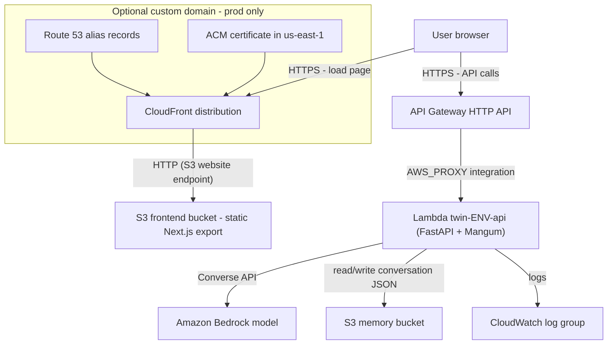
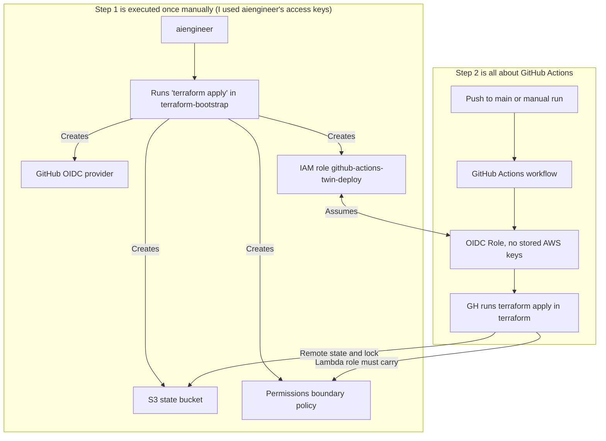

# Digital Twin

An AI "digital twin" you can chat with. A static Next.js frontend talks to a FastAPI backend running on AWS Lambda. The backend answers with an Amazon Bedrock model and keeps each conversation as a JSON file in S3.

**Terraform provisions all of the AWS infrastructure.** I use the AWS Console for one thing only: the one-time IAM setup for the `aiengineer` user in [step 1](#1-one-time-iam-setup-for-aiengineer). After that, I manage everything with `terraform` (`scripts/` is a convenient wrapper which does some other things before calling `terraform`).

## Architecture



The browser does two separate trips:

1. Page load: browser → (Route 53) → CloudFront → S3 static bucket → Next.js bundle renders in the browser.
2. API calls: browser (the JS code running in the browser) → (Route 53) → API Gateway → Lambda → Bedrock / memory bucket / CloudWatch.

| Component            | Terraform resource(s)                                   | Purpose                                                                 |
| -------------------- | ------------------------------------------------------- | ----------------------------------------------------------------------- |
| CloudFront           | `aws_cloudfront_distribution.main`                      | Global CDN and HTTPS in front of the frontend bucket                    |
| S3 frontend bucket   | `aws_s3_bucket.frontend` + website config + policy      | Hosts the static Next.js export (`frontend/out`)                        |
| API Gateway          | `aws_apigatewayv2_api.main` + routes + `$default` stage | `GET /`, `GET /health`, `POST /chat`, CORS, throttling                  |
| Lambda               | `aws_lambda_function.api`                               | Runs `backend/lambda_handler.handler` (Python 3.12, x86_64)             |
| Lambda IAM role      | `aws_iam_role.lambda_role`                              | Execution role with the `ci-managed-role-boundary` permissions boundary |
| S3 memory bucket     | `aws_s3_bucket.memory`                                  | Private bucket that stores conversation history as JSON                 |
| CloudWatch log group | `aws_cloudwatch_log_group.lambda`                       | Lambda logs with a set retention period (default 14 days)               |
| ACM and Route 53     | `aws_acm_certificate.site`, `aws_route53_record.*`      | Only when `use_custom_domain = true`                                    |

### How Terraform is organized

The repo has **two Terraform stacks**. They are separate because of a chicken-and-egg problem: CI can't create the state bucket or the IAM role that it needs before it can run Terraform at all.



[Step 1](#1-one-time-iam-setup-for-aiengineer) is the only part that has to run on your machine. After that, deploys happen in GitHub Actions: the workflow gets short-lived AWS credentials by assuming the role that bootstrap created, then applies the app stack. You can still run [`scripts/deploy.sh`](./scripts/deploy.sh) locally for the app stack if you want, but you don't need to.

| Directory             | Applied by       | State                                            |
| --------------------- | ---------------- | ------------------------------------------------ |
| `terraform-bootstrap` | Executed locally | Local (can be moved to the cloud later manually) |
| `terraform`           | CI/CD pipeline   | S3 backend, one state per env                    |

Environments (`dev`, `test`, `prod`) are Terraform workspaces in the app stack. Resource names are prefixed with `<project_name>-<environment>` (for example `twin-dev-api`), and bucket names end with the account ID.

## Repository layout

```text
digital-twin/
├── backend/                  # FastAPI app, system prompt
├── frontend/                 # Next.js app
│   └── out/                  # Static export output
├── terraform/                # App stack: everything the twin runs on
├── terraform-bootstrap/      # One-time stack: state bucket, GitHub OIDC, CI role, permissions boundary
├── scripts/
│   ├── deploy.sh             # Build Lambda zip → terraform apply → build frontend → sync to S3
│   └── destroy.sh            # Empty buckets, then terraform destroy
└── .github/
    └── workflows/
        ├── deploy.yml
        └── destroy.yml
```

> [!TIP]
>
> [`backend/deploy.py`](./backend/deploy.py) shows the usual way to package a Python Lambda function: it installs the dependencies inside the official Lambda runtime image (`public.ecr.aws/lambda/python:3.12`), so compiled packages match Lambda's Linux x86_64 environment, then zips them together with the app code.

## Prerequisites

- AWS CLI.
- Terraform `>= 1.10`.
- Docker.
- [uv](https://docs.astral.sh/uv/).
- NodeJS 20+.
- An IAM user named `aiengineer` with an access key. This user **is not managed by Terraform**. It is the identity that runs Terraform, so its permissions have to exist first.
- Bedrock model access in `bedrock_model_id` (default `amazon.nova-micro-v1:0`).

## 1. One-time IAM Setup for `aiengineer`

This is the only step I do outside Terraform as the root user, an admin, or in this case `aiengineer` IAM user. The table below is the **complete** set of policies that `aiengineer` needs for everything in this repo:

- Applying and destroying `terraform-bootstrap/`.
- Applying and destroying `terraform/` for every environment, including a custom domain.
- Running the backend locally against Bedrock and AWS S3.
- Managing its own access keys.

That's 8 policies, which is under the default quota of 10 managed policies per IAM user ([more info on how to increase it](https://repost.aws/knowledge-center/iam-increase-policy-size)).

| #   | Policy                          | Type             | Needed for                                                                                |
| --- | ------------------------------- | ---------------- | ----------------------------------------------------------------------------------------- |
| 1   | `AmazonS3FullAccess`            | AWS managed      | State bucket, frontend/memory buckets, `aws s3 sync` / `aws s3 rm` in the scripts         |
| 2   | `AWSLambda_FullAccess`          | AWS managed      | The Lambda function and its API Gateway invoke permission                                 |
| 3   | `AmazonAPIGatewayAdministrator` | AWS managed      | HTTP API, routes, stage, integration                                                      |
| 4   | `CloudFrontFullAccess`          | AWS managed      | Distribution and cache invalidations                                                      |
| 5   | `CloudWatchFullAccessV2`        | AWS managed      | The Lambda log group (create, retention, tags, delete) and reading logs/metrics           |
| 6   | `AmazonBedrockFullAccess`       | AWS managed      | Enbales you to call Bedrock when you wanna test it locally                                |
| 7   | `IAMUserChangePassword`         | AWS managed      | Changing the user's own console password                                                  |
| 8   | `TwinTerraformOperator`         | Customer managed | All the IAM parts plus ACM/Route 53, each scoped to the exact resources this repo creates |

> [!CAUTION]
> `aiengineer` must **not** have `IAMFullAccess`, directly or through a group. `IAMFullAccess` grants `iam:*` on every resource, so it is admin-equivalent: the user can run `aws iam attach-user-policy --user-name aiengineer --policy-arn arn:aws:iam::aws:policy/AdministratorAccess` on itself. Every scoped statement below would then be pointless.

```bash
aws iam list-user-policies --user-name aiengineer           # should print no inline policies
aws iam list-groups-for-user --user-name aiengineer         # should print no groups
aws iam list-attached-user-policies --user-name aiengineer  # should print exactly the 8 policies in the table
```

[`twin-terraform-operator.template.json`](./scripts/twin-terraform-operator.template.json) is all the policies needed for this app. Copy it to `twin-terraform-operator.json` and replace `<AWS_ACCOUNT_ID>` with the AWS account ID.

```bash
cp ./scripts/twin-terraform-operator.template.json ./scripts/twin-terraform-operator.json
./setup-twin-terraform-operator-policies.sh <AWS_ACCOUNT_ID>
```

The last step should be executed as root/admin, It's the same as doing it manually through the AWS Console: IAM → Policies → Create policy → JSON, then IAM → Users → `aiengineer` → Add permissions → Attach policies directly.

### Why the Custom Policy Looks the Way it does

The goal is to avoid reopening the `CreateRole` + `AttachRolePolicy` + `PassRole` privilege-escalation path. See [this flashcard](https://kasir-barati.github.io/aws-flashcards/privilege-escalation-vulnerability.html):

- **No arbitrary roles.** `iam:CreateRole`, `iam:AttachRolePolicy` and `iam:PutRolePolicy` are pinned to two role ARNs: `role/*-lambda-role` and `role/github-actions-twin-deploy`. `aiengineer` can't create or modify any other role in the account, so it can't mint a fresh admin-trusted role.
- **Lambda roles are capped by the boundary.** On `*-lambda-role`:
  - `iam:CreateRole` and `iam:PutRolePolicy` only work when the role carries the `ci-managed-role-boundary` permissions boundary. `terraform/main.tf` always sets it. The boundary denies `iam:*`, `sts:*`, `organizations:*` and `account:*`, so even an admin-like inline policy grants nothing beyond it.
  - `iam:AttachRolePolicy` only accepts the two managed policies `terraform/main.tf` attaches: `AmazonBedrockFullAccess` and `AmazonS3FullAccess`. `AWSLambdaBasicExecutionRole` isn't on the list, because `main.tf` replaced it with the scoped `lambda_logs` inline policy.
  - There is no `iam:UpdateAssumeRolePolicy` and no `iam:PutRolePermissionsBoundary`. `CreateRole` already sets the trust policy and the boundary, so `aiengineer` can't retarget the role's trust or swap its boundary later.
- **`iam:PassRole` is limited.** The scoped statement only allows passing `*-lambda-role`, and only to `lambda.amazonaws.com`. The bootstrap resources don't need `PassRole` at all.
- **No arbitrary policies.** `iam:CreatePolicy` and `iam:CreatePolicyVersion` are pinned to `policy/ci-managed-role-boundary`. `aiengineer` can't create or rewrite any other managed policy.
- **Bootstrap resources are pinned to exact ARNs:** the GitHub OIDC provider, the `github-actions-twin-deploy` role and the `ci-managed-role-boundary` policy.
- **Self-service is pinned to the caller.** The access-key and user-tag actions only apply to `user/${aws:username}`, so `aiengineer` can't mint keys for another user.
- **Unscoped statements:** the only statements with `Resource: "*"` use actions that AWS doesn't let you scope, or that only read data:
  - `sts:GetCallerIdentity`.
  - `iam:ListOpenIDConnectProviders`.
  - the ACM/Route 53 statements. `aws_route53_zone` has to look up the zone by name, and the certificate ARN is only known after it's created.

## 2. Configure the AWS CLI Profile

```bash
aws configure --profile twin-dev # access key of aiengineer, region eu-central-1
export AWS_PROFILE=twin-dev      # the app stack and scripts use the default credential chain
```

## 3. Apply the Bootstrap Stack -- Once

```bash
cd terraform-bootstrap
cp terraform.tfvars.example terraform.tfvars
# Edit terraform-bootstrap/terraform.tfvars
terraform init
terraform apply
```

## 4. Deploy the app

Create these environment variables in your GitHub repository (in the settings as secrets):

- `AWS_ROLE_ARN`: the `github_actions_role_arn` output.
- `AWS_ACCOUNT_ID`.
- `DEFAULT_AWS_REGION`.

And you need to add these env variables:

| Variable              | Default                 | Notes                                                                         |
| --------------------- | ----------------------- | ----------------------------------------------------------------------------- |
| `USE_S3`              | `false`                 | If `USE_S3` isn't `true`, memory is written to the local `memory/` directory. |
| `S3_BUCKET`           | `""`                    | The bucket used for storing the memory                                        |
| `CORS_ORIGINS`        | `http://localhost:3000` | The URLs that are allowed to access the API                                   |
| `AWS_PROFILE`         | `digital-twin`          | The AWS profile used for authentication                                       |
| `NEXT_PUBLIC_API_URL` | `http://localhost:8000` | The URL of the deployed backend API                                           |

And then when you push your changes to GitHub on `main` branch it will work. We do **not** use `terraform/variables.tf` instead they are passed through command line instead.

| Variable                   | Default                  | Notes                                                                  |
| -------------------------- | ------------------------ | ---------------------------------------------------------------------- |
| `aws_region`               | `eu-central-1`           | AWS region                                                             |
| `environment`              | passed by `deploy.sh`    | `dev`, `test` or `prod`                                                |
| `project_name`             | passed by `deploy.sh`    | Lowercase letters, digits and hyphens                                  |
| `bedrock_model_id`         | `amazon.nova-micro-v1:0` | The model needs to be enabled in Bedrock                               |
| `lambda_timeout`           | `60`                     | Seconds                                                                |
| `api_throttle_rate_limit`  | `5`                      |                                                                        |
| `api_throttle_burst_limit` | `10`                     |                                                                        |
| `log_retention_days`       | `14`                     | Lambda log group retention                                             |
| `use_custom_domain`        | `false`                  | Should we use a custom domain                                          |
| `root_domain`              | `""`                     | For example `example.com`. The Route 53 hosted zone must already exist |

### CI/CD (GitHub Actions)

- **Deploy** runs on every push to `main` (dev), or manually with an environment you pick. It assumes `github-actions-twin-deploy` through OIDC and runs `scripts/deploy.sh`. Then it invalidates CloudFront.
- **Destroy** runs only manually. You have to type the environment name to confirm, and then it runs `scripts/destroy.sh`.

The CI role doesn't use `aiengineer`'s permissions. `terraform-bootstrap/main.tf` gives it its own set:

- AWS managed policies for Lambda, S3, API Gateway, CloudFront, Bedrock, DynamoDB, ACM, Route 53 and IAM read-only.
- An inline policy that lets it create and manage **only** roles that are tagged `IamManagedByRole = github-actions-twin-deploy` **and** carry the `ci-managed-role-boundary` boundary.
- Permission to manage the `/aws/lambda/*` log groups.

This is why [`aws_iam_role.lambda_role` in `terraform/main.tf`](https://github.com/kasir-barati/digital-twin/blob/7b6719861285d9f919f6309e51c6e770cffb7181/terraform/main.tf#L82-L105) sets both that tag and the boundary.

## Known Improvements

1. The Lambda role attaches `AmazonS3FullAccess` and `AmazonBedrockFullAccess`. It only needs the memory bucket and the one model in `bedrock_model_id`, so replace both with a scoped inline policy. Then remove them from the `LambdaRoleAttachKnownPoliciesOnly` allow-list.
2. CloudFront talks to the S3 website endpoint over plain HTTP (`origin_protocol_policy = "http-only"`), and the frontend bucket is fully public. Switching to a private bucket with Origin Access Control would fix both problems.
3. API Gateway CORS still allows `*` origins. The Lambda enforces `CORS_ORIGINS` itself, but the gateway could be restricted too.

## The OIDC Thumbprint

`aws_iam_openid_connect_provider.github` sets a `thumbprint_list`. The thumbprint is a SHA-1 fingerprint of a certificate in GitHub's OIDC TLS chain. AWS originally used it to pin trust when fetching GitHub's signing keys. The IAM API still requires a value. Since mid-2023, though, AWS checks GitHub (and other well-known providers) against its own trusted certificate authorities instead of this thumbprint. So the value is a formality, not an active security control. See the [GitHub changelog](https://github.blog/changelog/2023-06-27-github-actions-update-on-oidc-integration-with-aws).
